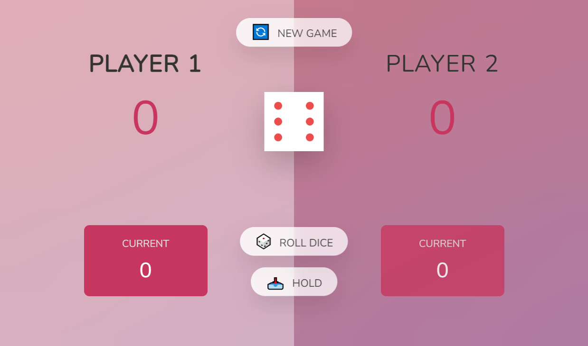

# Pig Dice Game

### Overview

This repository contains a simple implementation of the classic dice game called Pig Dice Game . The game is built using Javascript and provides a web interface for players to interact with the game.

### Screenshot

### Rules of the Game

Pig is a two-player game where the players take turns to roll a six-sided die:

- On each turn, a player rolls a die as many times as they want. The sum of the rolls is added to their current score.
- If a player rolls a 1, their current turn ends, and they lose all points gained in that turn. It becomes the other player's turn.
- The player can choose to "hold," which means their turn ends, and their current score gets added to their total score.
- The first player to reach a specified score of 20 wins the game.

### How to Play

**Open the website in bowser**

### [Demo](https://enigm413.github.io/Pig-Dice-Game/)

###

- **Roll DIce Button** : To roll the dice
- **Hold Button** : To Hold the score of player
- **New Game Button** : To reset the game
